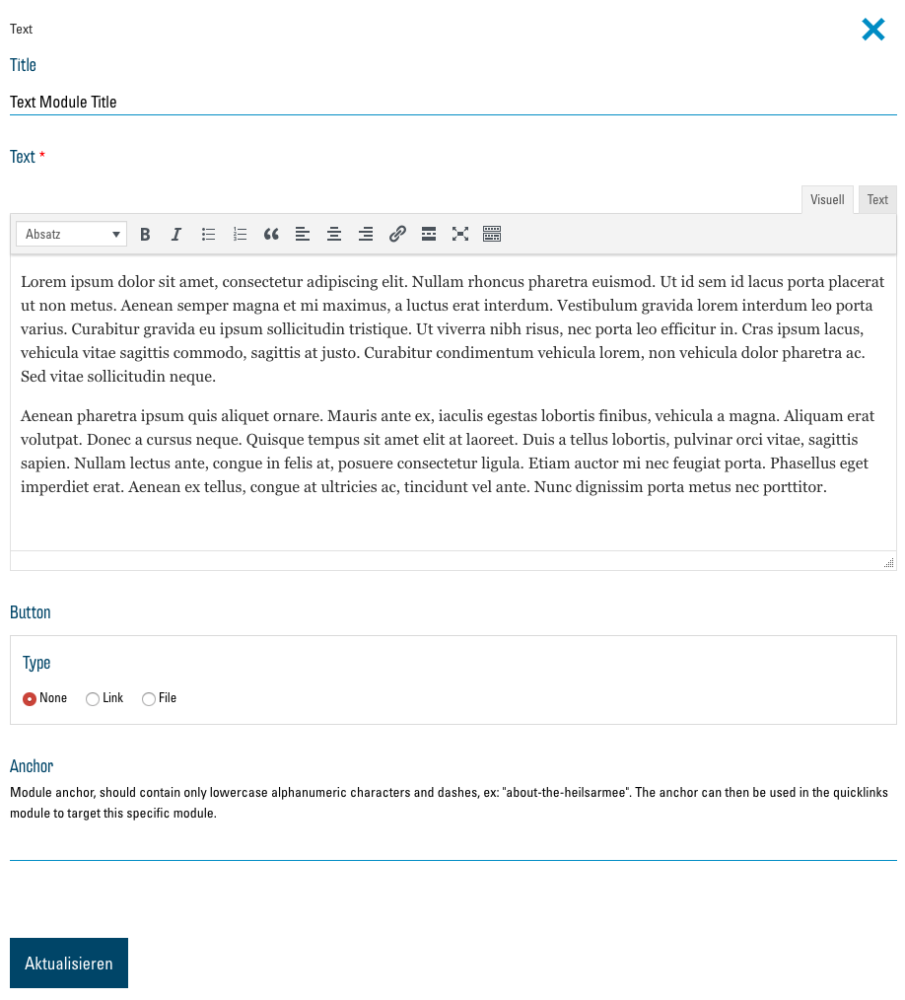
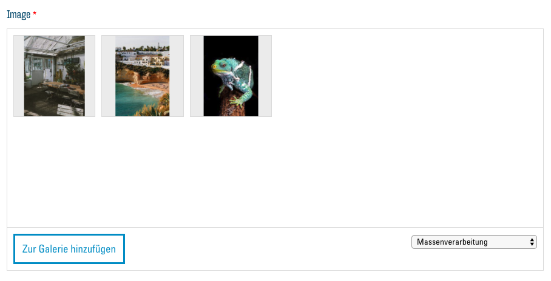
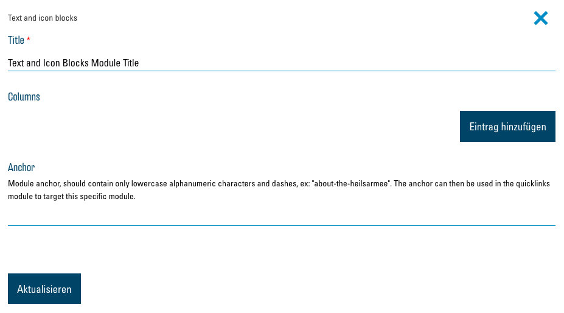
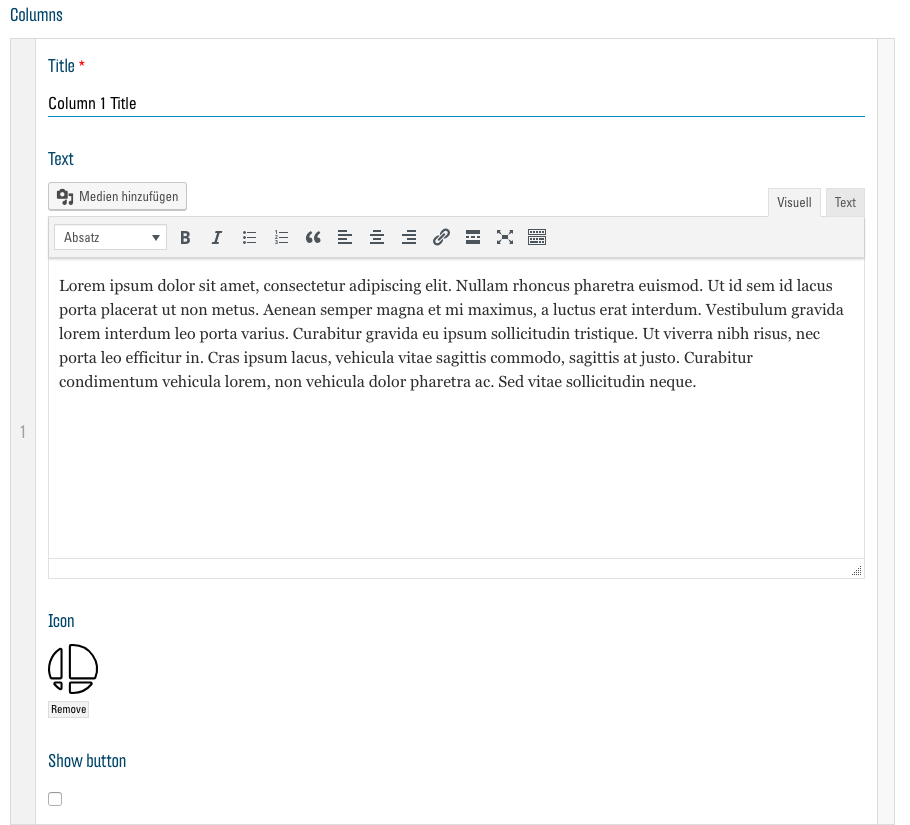
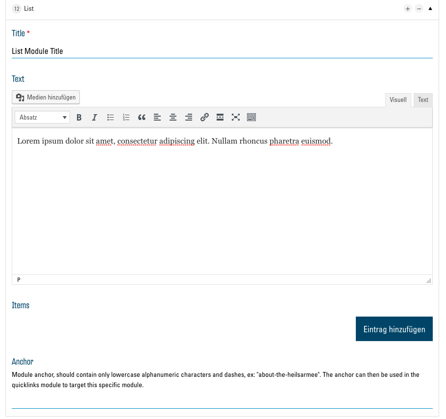
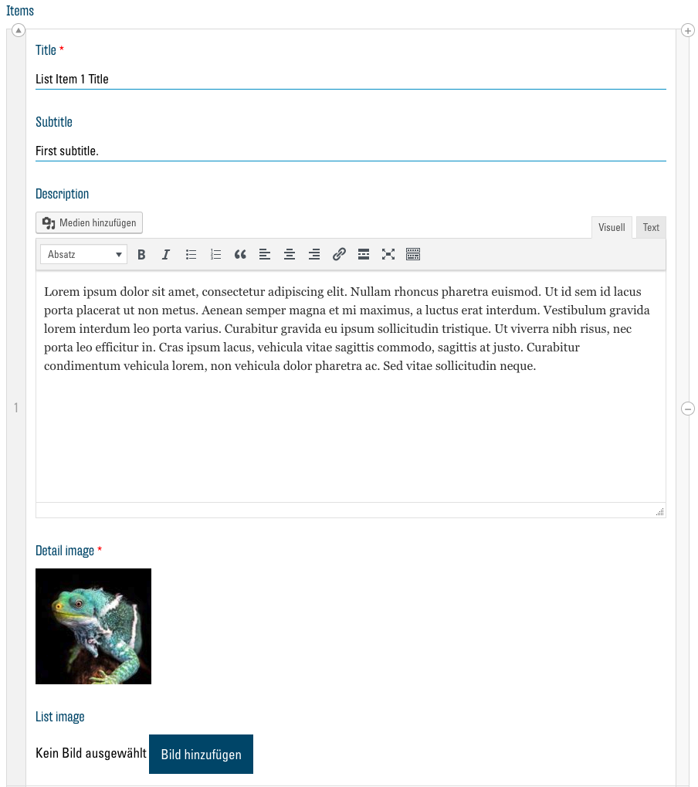
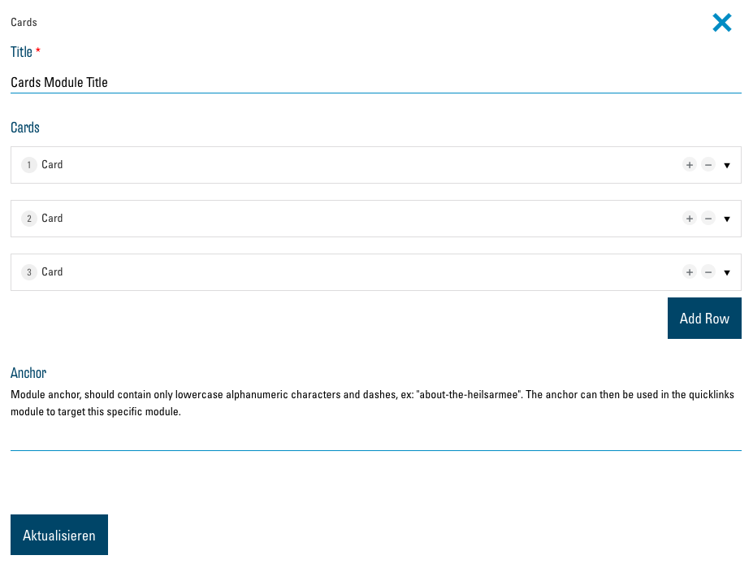
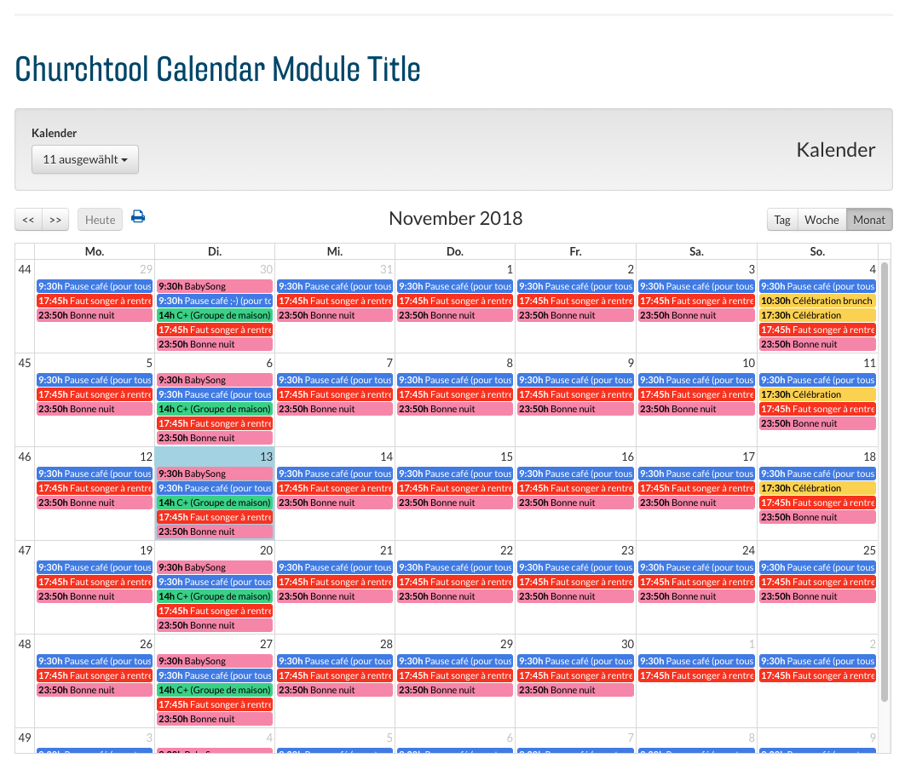
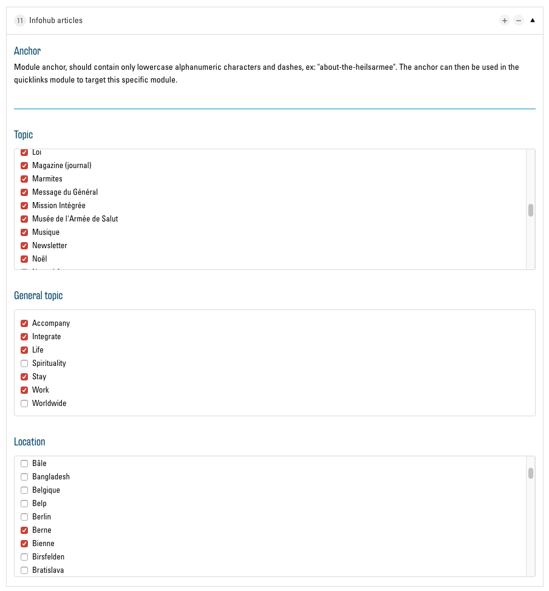

# Die Module

Es stehen Ihnen aktuell 12 Module zur Verfügung bereit. Hier werden diese beschrieben, gezeigt und die Optionen des jeweiligen Moduls erklärt. Jedes Modul hat ein Feld "Anchor" in den Optionen, welches hier ignoriert wird. Im Kapitel [Anchors und Quicklinks](03.01-quicklinks.md) wird dies genau erklärt. WICHTIG: Bestätigen Sie Ihre Änderungen an Modulen immer mit dem Button "Aktualisieren" ganz unten im Menü.

## Text

Das Text-Modul wird zum Darstellen von eines Text-Blocks mit einem Titel darüber verwendet.

### Optionen

In diesem Modul stehen Ihnen folgende Optionen zur Verfügung:

#### Title

In dieses Textfeld können Sie einen Titel für Ihren Text eingeben. Er wird dann über dem Text-Block angezeigt.

#### Text

Hier steht Ihnen ein einfacher Text-Editor zur Verfügung um den Text, welcher anschliessend als Text-Block auf der Webseite angezeigt wird, einzugeben und zu formatieren. Wie gewohnt können Sie den Text visuell anpassen. Der Button " Medien hinzufügen" sollte hier nur in wenigen Fällen verwendet werden. Besser ist es, ein Modul zu benutzen, welches Ihnen die Möglichkeit bietet Bilder einzufügen (z.B. [Image and Text](#image-and-text)).

#### Button

Diese Option erlaubt Ihnen, einen Button unten an Ihrem Text-Block einzufügen und damit auf einen Link oder eine Datei zu verweisen. [Erfahren Sie mehr zu Buttons und Links](03.00-links.md)

## Image and Text

Das "Image and Text"-Modul wird zum Darstellen von einem oder mehreren Bildern neben einem Text-Block genutzt.

### Optionen

Die [Optionen entsprechen dem Text-Modul](#text) mit der zusätzlichen Möglichkeit, eines oder mehrere Bilder einzubinden.

#### Image

Hier können Sie über den Button "Zur Galerie hinzufügen" Bilder aus Ihrer Mediathek auswählen und diese dem Modul hinzufügen. Wird mehr als ein Bild ausgewählt erscheinen auf der Webseite Buttons darüber um zwischen den Bildern zu navigieren. Mehr Informationen zur Mediathek hier: [Die Mediathek](01.01-library.md).

## Storytelling

Das Modul "Storytelling" ist standardmässig auf jeder neuen Webseite vorhanden. Es wird dazu verwendet, Ihre Community kurz einzuführen und den Besucher willkommen zu heissen. Es nimmt immer die gesamte Breite des Bildschirms ein und präsentiert so Ihren Text und Bilder auf sehr ansprechende Art.

### Optionen

[Die Optionen dieses Moduls sind beinahe identisch zum Modul Image and Text.](#image-and-text) Zusätzlich haben Sie hier aber die Möglichkeit, zwischen zwei Darstellungsarten des Moduls zu wählen.

#### Layout

Wählen Sie hier zwischen den zwei Darstellungsarten.

Overlay:

Image on left, text on right:

## Text and Icon Blocks

Mit diesem Modul können Sie Informationen in der Form von mehreren Spalten mit dazugehörigen Icons Buttons mit Links oder Dateien darstellen.

### Optionen

#### Title

In dieses Textfeld können Sie einen Titel für das Modul eingeben. Er wird dann über den Spalten angezeigt.

#### Columns

Hier wird eine Liste der Spalten, welche vom Modul angezeigt werden sollen dargestellt. Um dem Modul Inhalt hinzuzufügen müssen Sie also zuerst, mit dem Button "Eintrag hinzufügen", eine oder mehrere Spalten hinzufügen. Sie sehen danach eine neue Liste an Optionen, welche diese Spalte betreffen. Diese sind ähnlich zum [Modul Text](#text). Um Die Optionen zum Button zu sehen muss hier zunächst der Haken bei "Show button" gesetzt werden. Zusätzlich haben Sie hier die Möglichkeit ein Icon zur Veranschaulichung des Inhalts der Text-Spalte einzufügen.

#### Icon

Informationen zur Auswahl von Icons finden Sie hier: [Auswahl von Icons](03.02-icons.md)

#### Spalte entfernen

Um eine Spalte aus der Liste zu entfernen klicken Sie auf den "-"-Button neben dem entsprechenden Eintrag und bestätigen Sie mit "Remove".

## List

Das "List"-Modul stellt einen Text-Block und rechts daneben eine Liste von runden Bildern mit Titeln und Untertiteln dar. Wird auf eines dieser Elemente geklickt, so öffnet sich eine Detailansicht mit einem grösseren Bild und einer längerem Beschreibung. Das Modul eignet sich z.B besonders um die Menschen in Ihrem Team vorzustellen.

### Optionen

[Die Optionen des Moduls sind ähnlich zu denen des "Text and icon blocks"-Moduls](#text-and-icon-blocks). Anstelle von Spalten ("Columns") haben Sie hier eine Liste von Listenelementen ("Items"). Icons und Buttons werden von diesem Modul nicht unterstützt, dafür können Sie zwei Bilder pro Listenelement auswählen.

#### Items

Zusätzlich zu den Optionen der ["Columns" beim Element "Text and icon blocks"](#columns) besteht hier die Möglichkeit bei "Subtitle" einen Untertitel einzugeben, welcher in der Liste unter dem Titel angezeigt wird.
Unter "Detail image" und "List image" können Sie zwei verschiedene Bilder für das Item auswählen. Das "Detail image" wird in der Detailansicht des Listenelements angezeigt und das "List image" in der Liste der Elemente. Wenn Sie nur ein "Detail image" wählen und "List image" leer lassen, wird das "Detail image" für beide verwendet.

## Cards

Das "Cards"-Modul gibt Ihnen die Möglichkeit Informationen auf Karten darzustellen, welche dann, auf den Bildschirm des Besucher angepasst, in Spalten aufgelistet werden. Jede Karte kann aus einem Text, Bild, Button und Link bestehen.

### Optionen

[Dieses Modul ist ähnlich zu "Text and Icon Blocks"](#text-and-icon-blocks), mit einem zusätzlichen Link welcher unterhalb des Buttons eingefügt werden kann. Anstatt "Columns" hat dieses Modul "Cards".

#### Cards

Bei "Image" können Sie hier ein Bild aus der Mediathek auswählen. Dieses wird dann oben auf der Karte angezeigt. Bei "Secondary link" ist es hier möglich, identisch wie bei einem Button, einen zweiten Link einzufügen.

## Map and office hours

Das Modul "Map and office hours" bettet eine Google Maps Karte in Ihre Webseite ein und listet daneben Ihre Öffnungszeiten, Adresse und Telefonnummer. Diese Daten werden automatisch eingefügt, basierend darauf, was Sie in der [Konfiguration](00.03-config.md) als Institution angegeben haben. Als einzige Option haben Sie bei diesem Modul die Möglichkeit den Titel zu ändern.

## Store locator

Der "Store locator" zeigt eine Karte von Google Maps auf Ihrer Webseite an, auf welcher alle Angebote der Heilsarmee zu finden sind. Es gibt hier keine Optionen.

## Churchtool calendar

> TBD

## Churchtool events

"ChurchTools Calendar" ist eine Möglichkeit, einen Kalender aus ChurchTools in Ihrer Webseite anzuzeigen. Lesen Sie dazu hier: [Externe Seiten einbetten](03.03-embed.md).

## Infohub articles

Das "Infohub Articles"-Modul zeigt Artikel aus dem Heilsarmee-Infohub direkt auf Ihrer Webseite dar. Sie können in den Optionen des Moduls nach den gewünschten Themen und Orten filtern:

## Contact form

"Contact form" bietet Ihren Besuchern ein Formular um Ihnen eine Nachricht zu schreiben. Die Botschaft wird Ihnen anschliessend per E-Mail and die bei der [Konfiguration](00.03-config.md) angegebene E-Mail Addresse gesandt. Als Option können Sie bei diesem Modul einen Titel und ein Bild wählen, welches neben dem Formular angezeigt wird.
