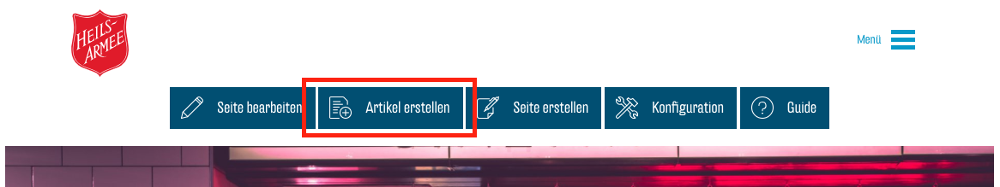
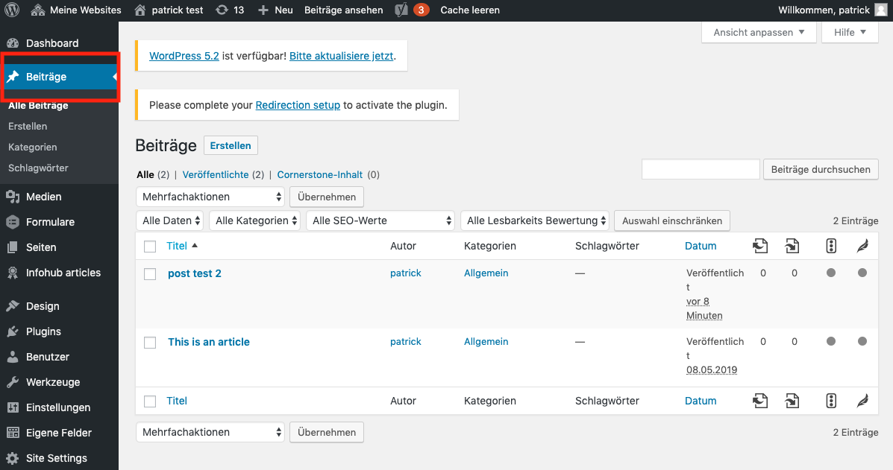
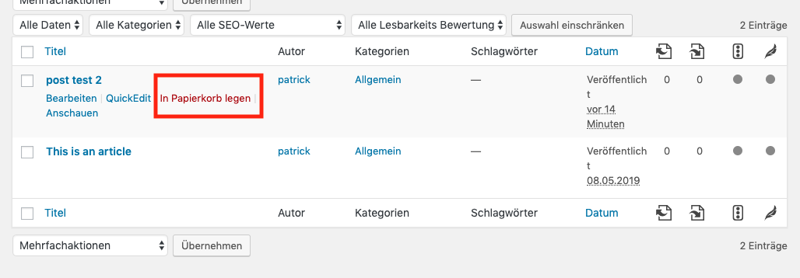

# Blog

Über Ihren Blog teilen Sie Gedanken, Ideen und Erlebnisse mit Ihren Lesern. Sie erstellen sogenannte Posts, bestehend aus Text, Bildern, Videos und anderen Medien. Diese werden dann in einer visuell ansprechenden Übersicht unter "Blog" im Hauptmenu dargestellt.

## Blogseite erstellen
Sobald Sie den ersten Post veröffentlichen, wird die Blog Seite automatisch erstellt und ins Menu eingefügt.

## Post erstellen
Wenn Sie sich auf Ihrer Seite einloggen, finden Sie im Admin-Menü den Knopf "Artikel Erstellen". Klicken Sie diesen.

### Titel
Der Titel erscheint gross am Anfang der Seite und wird auch auf der Übersichtsseite angezeigt.

### Inhalt
Hier fügen Sie den Text - und andere Inhalte, wie Foto, Video oder Audio - hinzu, wie Sie es sich gewohnt sind von den anderen Seiten.

### Bild
Hier muss zwingend ein passendes Bild hinzugefügt werden, das bei der Übersicht und im Post selbst angezeigt wird.

Klicken Sie dann auf "Artikel erstellen", um den Post zu veröffentlichen.

## Post löschen
Um den Post zu löschen, gehen Sie zu Ihrem Dashboard und wählen Sie "Beiträge"

Wenn Sie den Mauszeiger über einen Post führen, sehen Sie eine Auswahl an Aktionen. Wenn Sie "In den Papierkorb legen" wählen, wird der Post sofort gelöscht.

